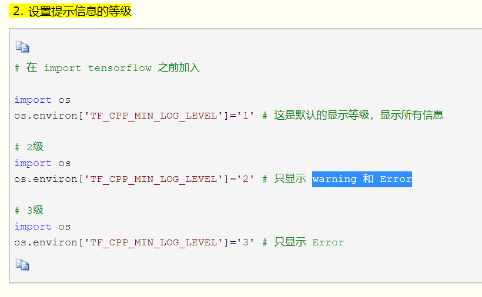

# MNIST手寫辨識

repositories:

[https://github.com/jessica-anyen/nn\_practice](https://github.com/jessica-anyen/nn_practice)

#### \#小筆記

- reshape vs resize

皆適用於矩陣

reshape: 會返回新值、不影響原有矩陣

resize:會返回新值、並影響原有矩陣

-設置提示訊息for tensorflow-gpu

#### [https://www.cnblogs.com/luruiyuan/p/6675073.html](https://www.cnblogs.com/luruiyuan/p/6675073.html)

#### -one-hot=true

把mnist数据集读取内存.读入方法的细节放在以后讨论.这里只有注意one\_hot=True这个参数.one\_hot表示用非零即1的数组保存图片表示的数值.比如一个图片上写的是0,内存中不是直接存一个0,而是存一个数组\[1,0,0,0,0,0,0,0,0,0\].一个图片上面写的是1,那个保存的就是\[0,1,0,0,0,0,0,0,0,0\]

[https://www.cnblogs.com/zhouyang209117/p/6517684.html](https://www.cnblogs.com/zhouyang209117/p/6517684.html)

-為何keras中可以直接輸入激活函數名稱?

見keras文檔

[https://keras.io/zh/activations/\#\_1](https://keras.io/zh/activations/#_1)

#### -

#### 

#### 

#### \#寶哥code

-優點:準確度高、數學式易解釋

-缺點:訓練模型時間長\(最佳時間/準確度訓練次數:fit=10000, sigmoid=50000\)、訓練模型無儲存功能、圖片限定格式\(56x56 ，位元深度:1\)

圖片儲存注意事項:

1.使用小畫家時，先將圖片調成56 X 56

2.存檔時選擇"單色bmp"\(使位元深度為1\)



#### \#load\_predict & keras\_mnist\_test

優點:具模型儲存功能、準確度高、可接受位元深度不為1的檔案

缺點:較難解釋、keras 版本不得為2.2.3

來源:

[https://blog.csdn.net/qq\_25109263/article/details/77801116](https://blog.csdn.net/qq_25109263/article/details/77801116)



#### \#完成註解說明版

見github: nn\_practice 

## \#參考資料

1.  用倒傳遞BPN寫MNIST

[https://github.com/TwVenus/BPN-for-MNIST](https://github.com/TwVenus/BPN-for-MNIST)

2. mnist 範例

[https://blog.techbridge.cc/2018/01/27/tensorflow-mnist/](https://blog.techbridge.cc/2018/01/27/tensorflow-mnist/)

3. tensorflow example之後的作業會用到\)



4.手寫數字圖片轉為 28 \* 28 方法



5. 

