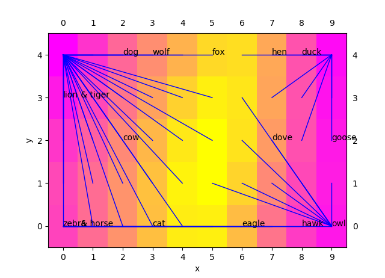

# som

#### \#程式: popsom



#### \#參考原始文件:



#### \#環境要求:

-python 版本:3.5 or 3.6\(3.7會有問題\)

-matplotlib版本:0.20.3\(其他會有問題\)

#### \#som分群圖顯示結果

這份code會顯示兩張圖，因為som分群數據較少，所以會是浮動結果

#### \#其他人的som



javascript版\(可線上網頁直接跑\)

[http://pirika.com/JP/ChemInfo/SOMdoubutu.html](http://pirika.com/JP/ChemInfo/SOMdoubutu.html)

